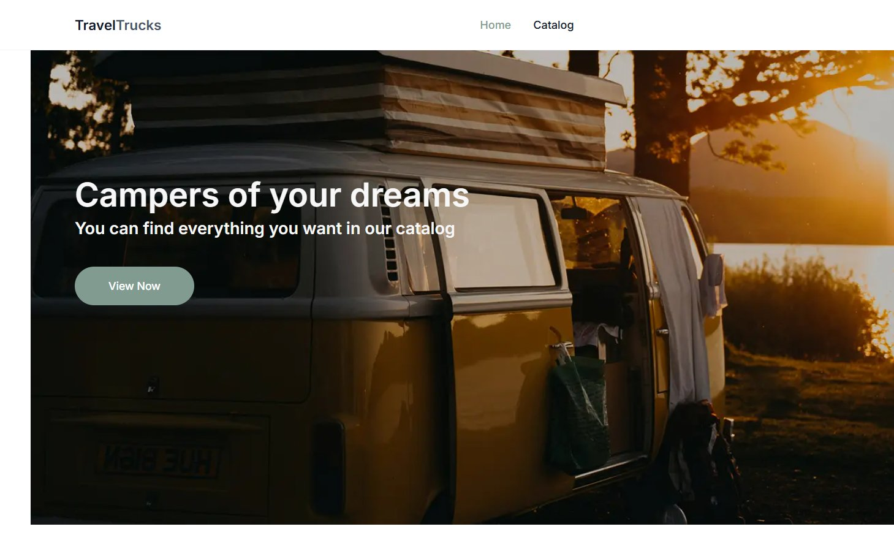
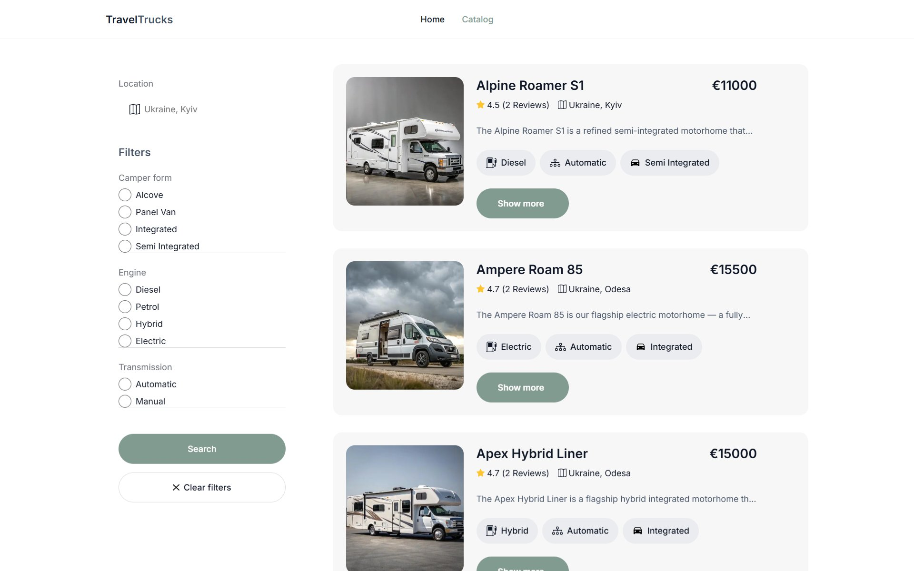
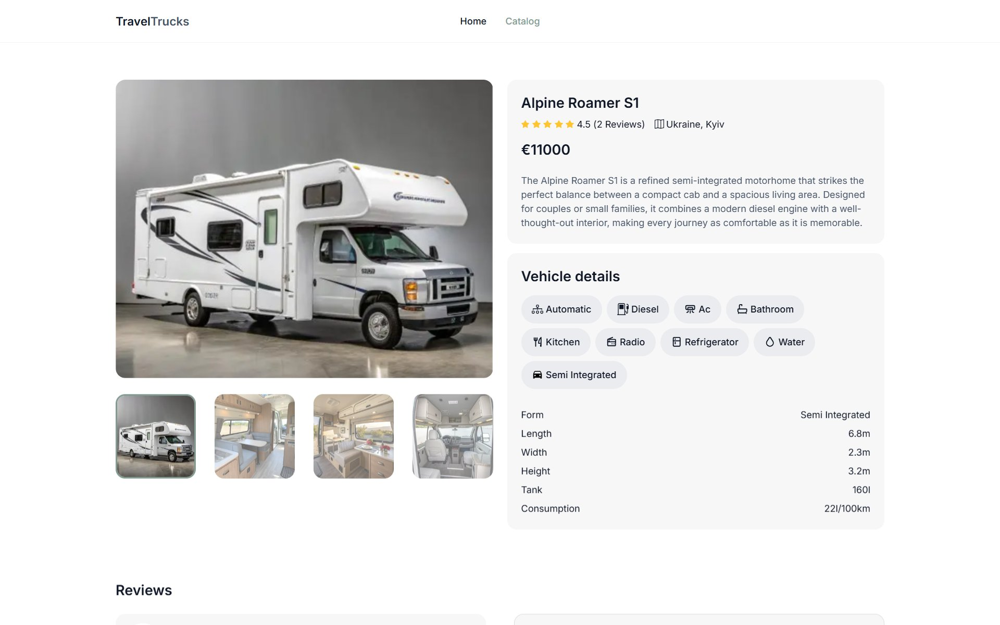

# TravelTrucks

[Українська](README.md) | [English](README.en.md)

A camper rental web application with a home page, filterable catalog, camper details page, image gallery, reviews, and booking form.

The project is built with **Next.js App Router** and **TypeScript**, using **TanStack Query** for working with the campers API: [campers-api.goit.study](https://campers-api.goit.study/docs).

**Demo:** https://project-travel-trucks-seven.vercel.app/

## Screenshots







## Core Features

- **Home page (`/`)** - hero banner with the main CTA and navigation to the catalog.
- **Camper catalog (`/catalog`)**:
  - filtering by location, body type, engine, and transmission;
  - loading available filter options from the API;
  - paginated camper loading with `useInfiniteQuery`;
  - `Load more` button for fetching the next page;
  - clearing active filters;
  - loading states, refetch overlay, no-results state, and API error handling.
- **Camper card**:
  - image, name, price, rating, review count, and location;
  - short description;
  - feature badges for engine, transmission, and body type;
  - navigation to the details page.
- **Camper details page (`/catalog/[camperId]`)**:
  - Swiper gallery with a main image and thumbnail navigation;
  - detailed vehicle description;
  - amenities and technical specifications;
  - customer reviews with star ratings;
  - booking form with validation and toast notifications.

## Tech Stack

- [Next.js](https://nextjs.org/) 16, App Router
- [React](https://react.dev/) 19
- [TypeScript](https://www.typescriptlang.org/)
- [TanStack Query](https://tanstack.com/query/latest)
- CSS Modules
- [Swiper](https://swiperjs.com/)
- [React Icons](https://react-icons.github.io/react-icons/)
- [React Hot Toast](https://react-hot-toast.com/)
- [React Loader Spinner](https://mhnpd.github.io/react-loader-spinner/)
- ESLint

## Technical Decisions

- API logic is isolated in `src/services`: base `apiFetch`, query param handling, `ApiError`, and separate functions for campers, reviews, filters, and booking requests.
- The API base URL is configured through `NEXT_PUBLIC_API_BASE_URL`, so the application is not tied to a hardcoded endpoint.
- The catalog uses `useInfiniteQuery`, which provides page control, caching, refetch behavior, and incremental result loading.
- Filters are stored in the catalog page state and included in the `queryKey`, allowing TanStack Query to keep cached data synchronized with the active filters.
- The camper details page is split into independent components: `CamperGallery`, `VehicleDetails`, `CamperReviews`, and `BookingForm`.
- The gallery is implemented with Swiper and synchronizes the active thumbnail with the main slide.
- The booking form includes client-side validation for name and email, ARIA error attributes, and a mutation request for creating a booking request.
- UI states are handled with dedicated components: `Spinner`, `LoadingOverlay`, `NoResults`, and `LoadMoreButton`.
- CSS Modules are used to isolate component styles and avoid class name conflicts.

## Challenges And Results

The main challenge was handling asynchronous data flows: the catalog must react to filters, support pagination, show intermediate loading states, and handle API errors correctly.

The camper details page also required careful composition: gallery, vehicle specs, reviews, and booking form each have their own logic while still forming one clear user flow.

As a result, the project became a production-ready camper search and booking application with filtering, incremental catalog loading, details pages, reviews, booking flow, and Vercel deployment.

## Project Structure

```text
src/
  app/          # App Router pages and layouts
  components/   # Reusable UI components
  hooks/        # TanStack Query hooks
  providers/    # QueryProvider and app-level providers
  services/     # API client and API functions
  types/        # TypeScript domain types
  utils/        # Label formatting and amenity icon helpers
public/
  campersImage/ # Static icons and images
  screenshots/  # README screenshots
```

## Getting Started

1. Clone the repository and install dependencies:

   ```bash
   git clone git@github.com:Andross-s/project-TravelTrucks.git
   cd project-TravelTrucks
   npm install
   ```

2. Create a `.env.local` file in the project root and define the API base URL:

   ```env
   NEXT_PUBLIC_API_BASE_URL=https://campers-api.goit.study
   ```

3. Start the development server:

   ```bash
   npm run dev
   ```

   The application will be available at [http://localhost:3000](http://localhost:3000).

## Available Scripts

| Command         | Description                      |
| --------------- | -------------------------------- |
| `npm run dev`   | Starts the development server    |
| `npm run build` | Builds the production app        |
| `npm run start` | Starts the production build      |
| `npm run lint`  | Runs ESLint                      |

## Design

The project design is available in [Figma](https://www.figma.com/design/6RTcCBTbI1junoYu1itOy0/Campers--Copy-?node-id=48730-474&p=f&t=mqTeYCAX3s3t3AVn-0). The desktop version of the interface is implemented.

## Author

**Andrij Skoropad** ([Andross-s](https://github.com/Andross-s))
